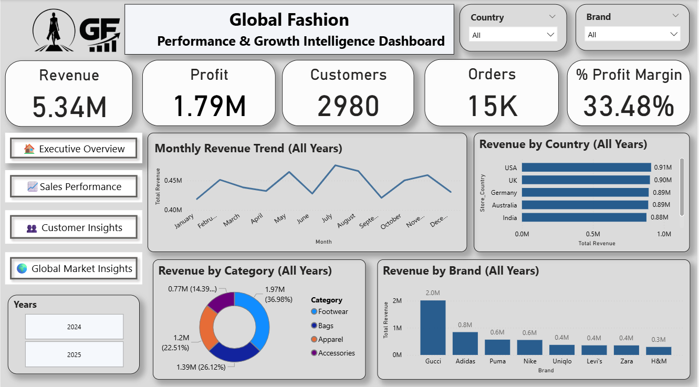
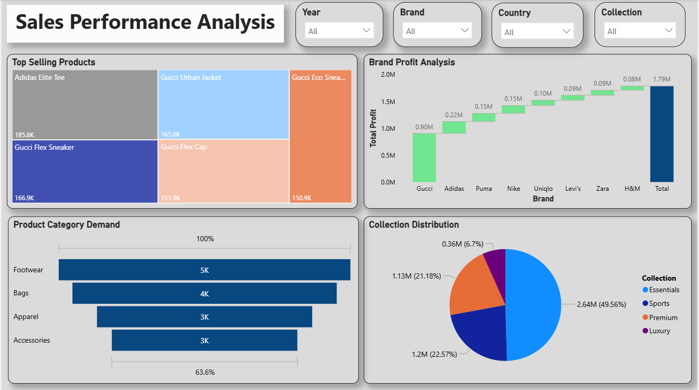
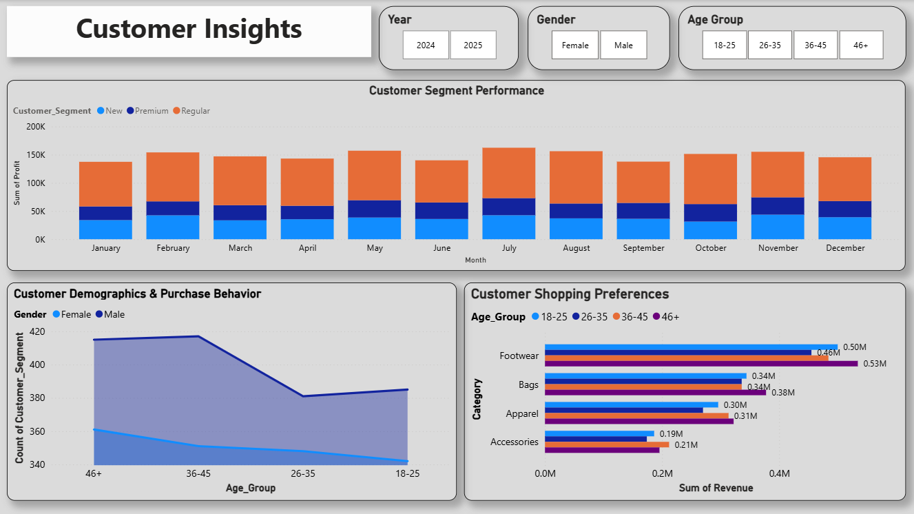
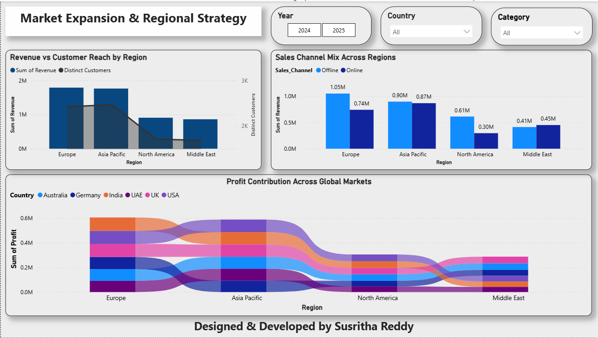

# 🌍 Global Fashion Performance & Growth Intelligence Dashboard

## 📌 Project Overview

This project is an interactive Power BI dashboard developed to analyze the performance of global fashion brands. The dashboard transforms raw sales data into meaningful business insights using data modeling, DAX measures, and interactive visualizations.

It helps business stakeholders understand revenue trends, customer behavior, product performance, and regional growth opportunities.

---

## 🎯 Business Objectives

- Analyze overall business performance
- Identify top-performing brands and products
- Understand customer purchasing behavior
- Compare regional sales performance
- Discover market expansion opportunities
- Support business decision-making through storytelling

---

## 🛠 Tools & Technologies

- Microsoft Power BI
- Power Query
- DAX
- Data Modeling
- Excel / CSV Dataset

---

## 📊 Dashboard Pages

### 1️⃣ Executive Overview

- Revenue KPIs
- Profit KPIs
- Orders
- Customers
- Monthly Revenue Trend
- Revenue by Country
- Revenue by Category
- Revenue by Brand

---

### 2️⃣ Sales Performance Analysis

- Top Selling Products
- Brand Profit Analysis
- Product Category Demand
- Collection Distribution

---

### 3️⃣ Customer Insights

- Customer Segment Performance
- Customer Demographics
- Shopping Preferences
- Gender & Age Analysis

---

### 4️⃣ Global Market Insights

- Revenue vs Customer Reach by Region
- Sales Channel Analysis
- Profit Contribution Across Global Markets

---

## ⭐ Key Features

- Interactive Filters
- Dynamic KPI Cards
- Business Storytelling
- Responsive Dashboard Layout
- Professional UI Design
- Star Schema Data Model

---
## 🗂 Data Model

The dashboard follows a Star Schema model with optimized relationships for better performance.

---
## 📸 Dashboard Preview

### Executive Overview

### Sales Performance

### Customer Insights

### Global Market Insights

### Data Model

---

## 📂 Repository Structure

PBIX/
Dataset/
Images/
Video/

---

## 👩‍💻 Developed By

**Susritha Reddy**

Power BI Developer | Data Analytics Enthusiast

---
